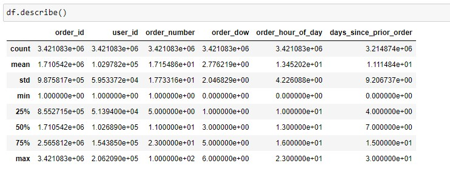
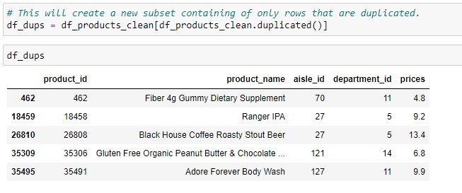
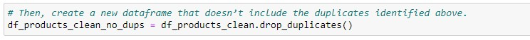
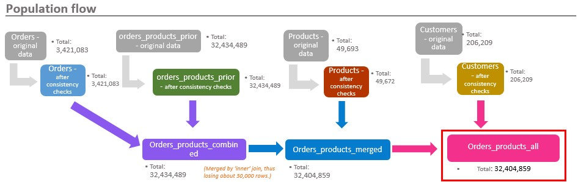
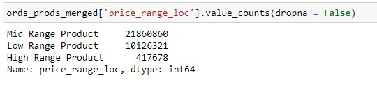
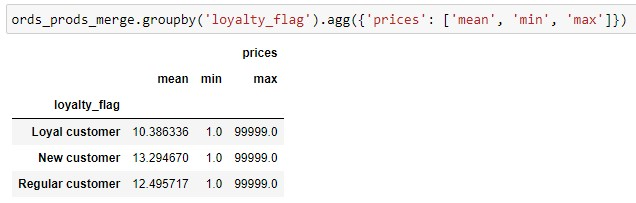
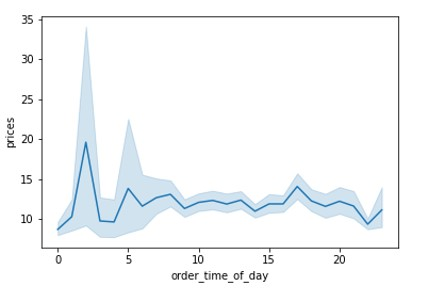
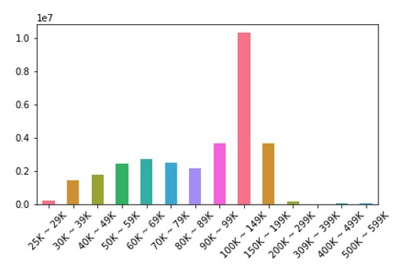
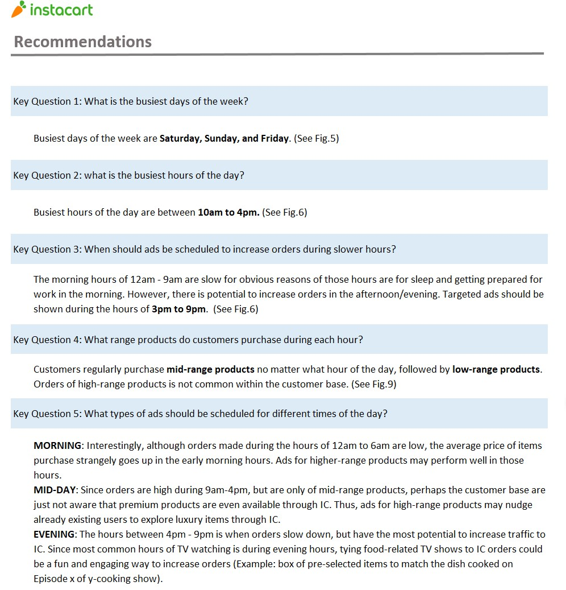
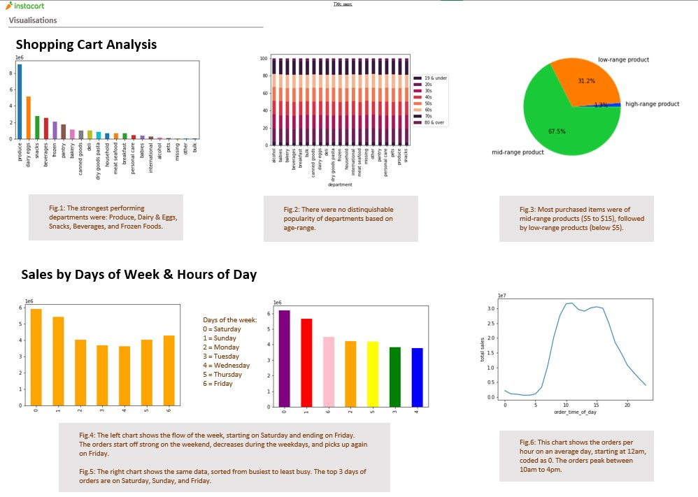

# Instacart Shopping Cart Analysis

  

### Background

Instacart, an online grocery service that operates through an app, is looking to improve their targeted marketing strategy. To fulfill this goal, the analyst has been tasked to uncover more information about sales pattern, different purchasing behaviors between customer types, and sales performance of each product for the Instacart database. Ultimately, the goal of the project is to perform an analysis to derive insights and suggest strategies for better segmentations based on the data and uncover specific customer profiles along with their typical purchasing patterns.

### Tools & Context
- **Python:** this programming language was used to perform the bulk of the analysis, including data cleaning, wrangling, subsetting, merging, aggregating, and visualization. 
- **Microsoft Excel:** final report presented in Excel, including analysis methodology, population flows, data visualizations, and final conclusions and recommendations on marketing strategy. 
- **Jupyter Notebook:** this web-based interactive computing platform was used for streamlined documentation of all Python scripts.

### Data Source
The data sets (with over 3 million rows) used for this analysis were made available by Instacart. [“The Instacart Online Grocery Shopping Dataset 2017”](https://www.instacart.com/datasets/grocery-shopping-2017) was accessed from the Instacart website on January 14th, 2022.  
 - Click [here](https://github.com/tiltonneena/InstacartProject-Python/tree/main/OriginalData) to download the data sets
 - Click [here](https://gist.github.com/jeremystan/c3b39d947d9b88b3ccff3147dbcf6c6b) to see the data dictionary 
 
### Key Questions 
 - What are the busiest days of the week and hours of the day?
 - What time of day do customer spend the most money? 
 - Which departments have the highest frequency of product orders?
 - Are there differences in ordering habits based on customer's loyalty status, region, or order frequency? 
 
### Methodology
1. Initial exploratory data analysis performed to first understand the large database, followed by data cleaning, wrangling, and merging. 

    

      
    

    

      <em>Exploratory analysis was initialized by descriptive analysis.</em>
    

 
    

      
    

    

      <em>Duplicated data was found by being sectioned off into a subset.</em>
    
   

    

      
    

    

      <em>Once duplicated data was found, they were cleaned from the main dataframe using a built in Python function.</em>
    

    

      
    

    

      <em>Four separate datasets were merged into one main dataframe.</em>
    

    
2. Once the dataframe was thoroughly cleaned, new variables were created by derivation and aggregation. 

    

      
    

    

      <em>One of the new variables created categorized products into three pricing type.</em>
    

    

      
    

    

      <em>Newly created categorical variables were aggregated for further insight.</em>
    

3. Data visualizations were created, often using crosstabs, for better and easier communicating of key findings. 

    

      
    

    

      <em>Line chart made using Python showing the fluctuating prices of items ordered throughout the day.</em>
    

    

      
    

    

      <em>Bar chart showing the distribution of customers grouped by income range.</em>
    

4. Finalized a full report of the analysis for the stakeholders in Excel. The report answered key questions, records of population flow (dataset merging), records of data cleaning/wrangling, column derivation, data visualizations, and recommendations to inform marketing strategies.   
    
    

      
    

    

      <em>All data related questions were answered on the final page of the report.</em>
    

### Key Findings
-	Busiest days of the week were Saturday, Sunday, and Friday.
-	Orders between the hours of 12am to 9am were slow for obvious reasons, however, high potential present to increase sales between 3pm to 9pm, hence ads should be run during those hours. 
-	Customer loyalty amongst the customer base: 
      51.3% are Regular customers (10 - 40 orders) 
      33.2% are Loyal customers (40+ orders) 
      15.5% are New customers (less than 10 orders)
-	Regardless of customer loyalty status, most customers were categorically “low spenders” and were frugally-minded, this is important to keep in mind when targeted ads are being crafted.
-	The department with the highest sales was the produce department. 

### Deliverable
### [Final Stakeholder Report](https://github.com/tiltonneena/InstacartProject-Python/blob/main/Instacart_final_report.xlsx)
 

  

   

 
 
